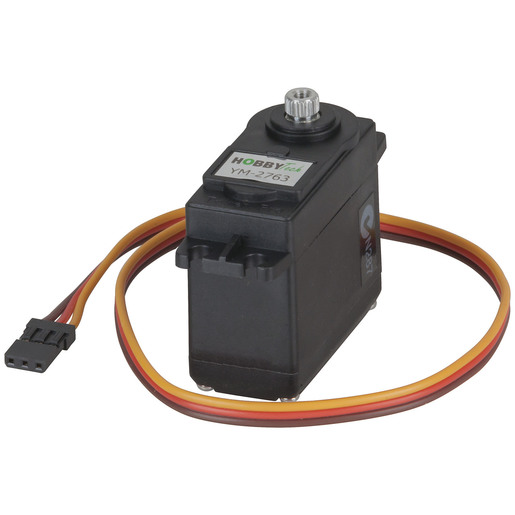

# Servos
Servos are a particular type of motor built for small, rapid, controlled movements.

A typical servo looks like a box with a little shaft coming out:

There are typically four holes for mounting (two behind and two in front); and three wires coming out.

You may also see a cross / line shaped structure sitting on top of the servo. That structure is called a servo horn; and most of the time it is removable / interchangeable.

## Where to use servos
- Servos are small, but because of this they're typically less powerful than larger motors.
### Choosing the right servo
There are a number of different servos on the market. To choose one that is right for your application, here are some things to look out for:
- Torque: Torque is the amount of radial force a servo can exert. Higher torque is typically bettter.
- Speed: Some high torque motors may trade torque with speed; but if you need a quick response from your servo they might not be the right fit for you.
- Size: Servos come in a few standard sizes, but as with all parts, it's good to buy the part before you fabricate, or you might find that your servo doesn't fit in the mount you've made for it.
### Continuous rotation servos
- Although most servos translate the input signal to an angular position, some servos transform it into a set speed. Despite not being able to hold position, these servos do have the added bonus of more than 180 degrees of motion.
- You can in fact turn any normal servo into a contiuous rotation servo, if you're feeling up to it! Here's a link: https://www.youtube.com/watch?v=zZGkkzMBL28
## How to use servos
1. Purchase the servo.
2. Make measurements with calipers so that you can design your robot around the servo for your mount. Don't forget a space for the wire!
3. Choose a servo horn and make measurements with calipers. Design your arm around the servo horn. (Don't forget to take into account the vertical offset! You  might be able to fit a whole 3mm ply sheet in between!)
4. Wire up the servo. You can attach the black and red to a ground/power rail and have the yellow PWM wire connected to an arduino or other output pin.
5. Write code. Depending on what plaform you're using, this might be as simple as using a library (Arduino), or using a timer output compare (if you're going reallly low level).
6. Calibrate the servo. Using a protractor, set the servo to a variety of angles in software, and see what they come out to be in hardware. If you're not in a rush, you can do individual points, but a linear approximation is often good enough.
7. You're off!
### Protips
- Calibrate them! Not all servos are perfect, but fortunately you can adjust it in software.
- Make sure they have enough current.
- You may need a servo controller if you're controlling multiple servos at once.